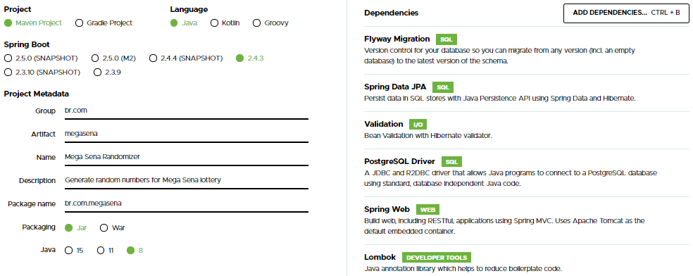

> **Aviso**: Este projeto foi desenvolvido no início da minha carreira como parte do meu processo de aprendizado. Embora funcione conforme o esperado, ele pode não refletir as práticas ou tecnologias mais atuais. Ainda assim, espero que possa servir como uma fonte útil de referência e aprendizado. Explore o código à vontade!

**API REST em Java usando Spring Boot**

Neste post vamos aprender a construir uma API REST em Java do zero
usando o framework Spring, juntamente com Hibernate e o PostgreSQL como
nosso banco de dados relacional.

Não é preciso ter nenhum conhecimento prévio nas ferramentas que serão
utilizadas, mas espera-se que tenha conhecimento em Java, noções de
Maven e banco de dados e SQL.

**O desafio**

O nosso desafio é criar uma API REST para gerar números aleatórios para
jogadas na loteria, simples assim. Entretanto, como a loteria possui
diversos tipos de jogos e maneiras diferentes de jogar, vamos definir
que nossa API irá gerar números apenas para a Mega-Sena. Saiba que a
Mega-Sena sorteia apenas 6 números distintos entre 1 e 60.

Então, em primeiro lugar precisamos de um endpoint que gera 6 números
aleatoriamente, e na chamada deste endpoint deve ser fornecido um e-mail
válido.

Também precisaremos de outro endpoint onde, informado o e-mail, deve ser
retornada uma lista com os números gerados anteriormente para tal
e-mail.

Bem simples, então vamos lá.

**Analisando**

Com base no desafio proposto, podemos fazer algumas observações:

1.  Precisamos criar uma API REST, e nada mais adequado do que o Spring
    para atender essa necessidade de forma simples e rápida.

2.  Precisamos validar um e-mail, e o Hibernate, que já vamos usar,
    também nos dará tudo que precisamos para fazer esta verificação sem
    quebrar a cabeça.

3.  Precisamos gerar números aleatórios, distintos, e dentro de uma
    faixa limitada. Isto será simples e rápido com recursos nativos da
    linguagem.

4.  E um dos endpoints deve retornar todo o histórico de números gerado
    para determinado e-mail, logo, vamos ter que armazená-los e, ainda,
    relacionar cada resultado ao seu respectivo e-mail para viabilizar
    essa funcionalidade. O PostgreSQL será nosso banco de dados, iremos
    utilizar o Flyway para criar as tabelas necessárias. Aqui o
    Hibernate também vai facilitar ainda mais a nossa vida durante o
    desenvolvimento.

**As Tecnologias**

Antes de colocar a mão na massa, vamos entender todas as tecnológicas
mencionadas acima.

O **Spring** é um framework open source criado para Java, ele se baseia
principalmente nos padrões de projeto Inversão de Controle e Injeção de
Dependências. O Spring fornece suporte a microsserviços, cloud, web,
persistência, eventos, batch, segurança, dentre outros; é um projeto
enorme, e também com muitas possibilidades de personalização, por isso,
ele foi dividido em várias partes, então cada projeto apenas traz aquilo
que necessita.

Utilizando Spring o desenvolvimento é mais rápido e produtivo, temos em
mãos inúmeras ferramentas que precisaríamos fazer manualmente. Uma
desvantagem é quanto ao tempo de inicialização do nosso sistema, pois
essa facilidade toda não vem de graça, o sistema vai demorar um pouco
mais para iniciar já que o Spring precisará criar um contexto com toda
configuração e instâncias necessárias para o funcionamento completo da
aplicação.

Dentro destes "blocos" do Spring temos o Spring Data JPA, é este que nos
fornece recursos para trabalhar com persistência de dados SQL de forma
simples e padronizada. Chega de implementar DAOs, escrever queries,
controlar transações e conexões manualmente! O Spring utiliza o
**Hibernate**, um ORM que implementa todas as especificações do JPA.

O principal papel do Hibernate é facilitar o mapeamento das nossas
entidades com o respectivo modelo de dados, diminuindo a complexidade de
desenvolver uma aplicação Java que precisa persistir dados em um banco
SQL. Da forma convencional, precisaríamos implementar manualmente a
conversão de um ResultSet em uma instância de um objeto, mas com o
Hibernate basta fazer algumas anotações, e o ORM irá converter
automaticamente. Uma desvantagem de se utilizar este framework vem na
performance, se o mapeamento ou o modelo de dados não for bem pensado, o
Hibernate pode demorar mais para efetuar as operações do que uma query
direta sem conversão entre objetos, mas isto não é um grande problema
para a maioria das aplicações.

Ainda falando sobre persistência, utilizaremos o framework **Flyway**,
uma ferramenta simples e leve para versionar nosso banco de dados. É
muito comum uma aplicação ser entregue em etapas, e mesmo após a
conclusão, ter adição de recursos ou manutenções. Tudo isso pode
impactar no modelo de dados, havendo necessidade de criação ou alteração
de tabelas, campos, funções, etc.. Fazer manualmente estas alterações
não é uma boa prática, além do trabalho há risco de erro, execução de
scripts fora de ordem, esquecimento, podendo comprometer o banco de
dados. Com este framework automatizamos este trabalho, criamos scripts
que são executados em sequência sempre que a aplicação iniciar e
identificar que a versão do banco de dados é mais antiga do que a dos
scripts.

Saindo da persistência e indo para uma camada de mais alto nível, com o
Spring utilizaremos um de seus componentes chamado **Spring Web**, com
ele já teremos um servidor Tomcat para nossa aplicação REST, do
contrário teríamos que implementar tudo na mão e, ainda, configurar o
servidor. Também teremos facilidade para criar nossos endpoints apenas
com algumas anotações, e o Spring cuidará de toda parte de rotas,
serialização e desserialização dos dados nas chamadas HTTP.

Ainda vamos usar duas tecnologias, mas sem nos aprofundar muito.
Aproveitaremos para usar o **Lombok**, um framework para facilitar o dia
a dia do desenvolvedor. Com ele você escreve menos código "boilerplate",
e é mais eficiente. Então esqueça getters, setters, construtores,
equals, hashcode, toString, etc., estes códigos básicos e repetitivos
serão criados automaticamente com o Lombok, só precisamos indicar isto.
O outro framework utilizado será o **Hibernate Validator**, com ela
podemos fazer validações em classes, atributos, parâmetros, simplesmente
com algumas anotações, sem precisar criar código.

Entretanto, tudo isso poderia ser complicado de juntar e configurar, mas
para facilitar ainda mais temos o **Spring Boot**, que já vai deixar
tudo pronto e configurado no nosso projeto, e precisaremos fazer o
mínimo de alterações antes de rodar a aplicação. Na verdade, não
precisaríamos alterar absolutamente nada, mas como estamos usando um
banco de dados externo, precisamos configurar o acesso a este banco.

**Começando**

Uma das formas mais rápidas de iniciar um projeto do Spring Boot é
através do **Spring Initializr** disponível no endereço
<https://start.spring.io/>. Acesse e preencha os campos conforme a
imagem abaixo, adicionando cada uma das dependências descritas a seguir:

-   Flyway Migration
-   Spring Data JPA
-   Validation
-   PostgreSQL Driver
-   Lombok
-   Spring Web



Após isso, basta clicar no botão GENERATE para fazer download de um
arquivo compactado com seu projeto Spring montado. Agora, basta
descompactar e importar este projeto na sua IDE de preferência para
continuar.

**Configurações Iniciais**

Antes de compilar o projeto, vamos deixar pronta toda configuração
necessária para a aplicação funcionar. Como usamos o Spring Initializr,
boa parte da configuração já veio e apenas precisamos configurar o
acesso ao banco de dados e o Flyway.

Localize o arquivo ```application.properties``` e coloque as seguintes
configurações (revise os dados de conexão ao PostgreSQL de acordo com
sua instalação):

```
#Config. servidor REST
server.port=8080

#Config. banco de dados
spring.datasource.platform=postgres
spring.datasource.url=jdbc:postgresql://localhost:5432/postgres
spring.datasource.username=postgres
spring.datasource.password=postgres
spring.jpa.database=POSTGRESQL

#Config. Flyway e DDL
flyway.enabled=true
spring.flyway.table=megasena_flyway_schema_history
spring.flyway.check-location=false
spring.jpa.hibernate.ddl-auto=validate
```

Com estas configurações, a aplicação será executada e poderá ser
acessada no endereço <http://localhost:8080/>. Além disso, a aplicação
conseguirá se conectar ao PostgreSQL e o Flyway também está configurado
para criar as tabelas necessárias para esta aplicação.

**Implementação dos Endpoints**

Poderíamos começar este projeto em vários pontos, mas vamos primeiro
implementar os endpoints e, a partir daí, desenvolver as camadas mais
baixas da aplicação.

Criaremos um Controller, neste vamos definir os dois endpoints, os
valores de entrada e de saída de cada um, URLs personalizadas e
trataremos da validação do e-mail. Nossa classe ficará assim:
```
@RestController
@RequestMapping(value = "/lottery", consumes = ALL_VALUE, produces = APPLICATION_JSON_VALUE)
@Validated
public class RandomGameController {

@GetMapping(value = "/generate")
public int[] generate(@RequestParam @NotBlank @Email String email) {
    return new int[]{10, 20, 30, 40, 50, 60};
}

@GetMapping(value = "/history")
public List<int[]> history(@RequestParam @NotBlank @Email String email) {
    return new ArrayList<int[]>() {{
        add(new int[]{1, 2, 3, 4, 5, 6});
        add(new int[]{10, 20, 30, 40, 50, 60});
    }};
}

}
```

Ao anotar uma classe com @RestController o Spring irá identificá-la e
então preparar automaticamente os endpoints definidos ali quando o
contexto for iniciado.

Com a anotação @RequestMapping no topo da classe nós estamos definindo
que todo endpoint ali definido terá o prefixo ```/lottery```, além disso,
estamos definindo que aceitaremos qualquer tipo de conteúdo nas
requisições, mas sempre responderemos com um corpo no formato JSON.

Nesta classe criamos dois métodos, cada um anotado com @GetMapping e um
endereço. Isto faz com que dois endpoints passem a existir em nossa API
REST. Como ficará o endereço destes endpoints? Considerando que estamos
executando a API localmente na porta 8080 configurada no
```application.properties```, e que definimos o prefixo ```/lottery``` a nível de
classe, então estes endpoints terão os seguintes endereços,
respectivamente;

> localhost:8080/lottery/generate

> localhost:8080/lottery/history

Em cada um dos endpoints precisamos informar um e-mail, e este precisa
ser válido. A anotação @RequestParam diz ao Spring que esperamos um
parâmetro com o nome email, que é o mesmo nome do atributo String email.
Com isto, o endpoint pode ser chamado desta forma:

> localhost:8080/lottery/generate?email=email_valido@dominio.com.br

> localhost:8080/lottery/history?email=email_valido@dominio.com.br

E a validação? Bom, repare no topo da classe a anotação @Validated,
isto diz ao Spring que todo endpoint ali pode possuir atributos que
precisam ser validados, mas ela só funciona se houver alguma validação
estipulada. Por isto, também anotamos o atributo String email com
@NotBlank e @Email, para que seja verificado se o e-mail não é uma
String vazia e, além disso, é um e-mail válido.

Poderíamos validar inputs de inúmeras formas, mas neste desafio esta é
uma forma simples, direta e precisa de validar tudo que precisamos.

Por fim, vamos observar os retornos dos endpoints. No primeiro endpoint
retornamos um array de números inteiros. No segundo endpoint retornamos
uma lista de arrays de números inteiros. Se reparar na implementação dos
métodos, um retorno fixo já foi criado. Nossa aplicação final não ficará
assim, estes valores foram fixados apenas para que possamos testar
nossos endpoints.

**Testando o Funcionamento dos Endpoints**

Compile a aplicação e execute-a. Ao acessar o endpoint
```localhost:8080/lottery/generate?email=email_valido@dominio.com.br```, o
retorno deverá ser:
```
[
    10,
    20,
    30,
    40,
    50,
    60
]
```
E ao acessar ```localhost:8080/lottery/history?email=email_valido@dominio.com.br```, o retorno deverá ser:
```
[
    [
        1,
        2,
        3,
        4,
        5,
        6
    ],
    [
        10,
        20,
        30,
        40,
        50,
        60
    ]
]
```
**Implementação do Gerador de Números**

Nossos endpoints estão funcionando, validando o e-mail e retornando tudo
no formato esperado. Mas precisamos fazer o serviço funcionar com
números aleatórios e salvar esta jogada, e este é nosso primeiro método
a implementar.

Primeiramente, crie um arquivo chamado ```V1__create-table-game.sql```
dentro da pasta ```src/main/resources/db/migration``` com o seguinte conteúdo:
```
create table game (
    id bigserial not null,
    created_date timestamp not null,
    email varchar(255) not null,
    numbers varchar(255) not null,
    primary key (id)
);
```
Não é necessário executar este SQL no seu PostgreSQL, nossa aplicação,
através do Flyway, irá executar todos os scripts da pasta ```db/migration```
automaticamente na ordem estipulada. Viu o prefixo ```V1__```? É um padrão
do Flyway, uma das formas de controlar a ordem dos scripts SQL a serem
executados no banco de dados.

Feito a tabela, vamos criar então uma classe para refletir essa
entidade:
```
@Getter
@Setter
@Entity
public class Game {

    @Id
    @GeneratedValue(strategy = GenerationType.IDENTITY)
    private Long id;
    
    private String email;
    
    @Convert(converter = IntArrayConverter.class)
    private int[] numbers;
    
    @Column(updatable = false)
    private Instant createdDate;
    
    @PrePersist
    private void prePersist() {
    createdDate = Instant.now();
    }

}
```
Aqui temos diversas anotações para fazer um mapeamento apropriado usando
a especificação JPA, implementada pelo Hibernate. Primeiramente, a
classe precisa ser anotada com @Entity. Então temos os 4 atributos,
conforme nossa tabela criada, e cada atributo devidamente mapeado, mas
há alguns detalhes:

-   ```Long id```: a anotação @Id diz ao Hibernate que esta é a chave
    primária da nossa entidade, e a anotação @GeneratedValue do tipo
    IDENTITY informa que este ID será gerado pelo banco de dados,
    automaticamente. Repare que lá na criação da tabela o id é uma
    coluna do tipo bigserial, isto é, um long com auto-increment.


-   ```String email```: aqui não há segredo, não é necessária nenhuma anotação
    para que o Hibernate mapeie uma coluna do tipo String para um campo
    varchar do banco de dados.


-   ```int[] numbers```: aqui ocorre algo interessante! Apesar do PostgreSQL
    suportar colunas do tipo Array, o Hibernate não suporta isto
    nativamente. Assim, para facilitar, criamos esta coluna no banco de
    dados com o tipo varchar. Mas como o Hibernate vai transformar um
    array de inteiros em uma String? Precisamos ensiná-lo, e aí que
    entra a anotação @Convert, onde passamos uma classe que faz esta
    conversão na ida e na volta. Veremos a classe IntArrayConverter
    daqui a pouco.


-   ```Instant createdDate```: o Instant é o tipo equivalente ao Timestamp do
    PostgreSQL, então o Hibernate fará a conversão adequada. Mas aqui
    temos outra coisa interessante, a opção updatable = false na
    anotação @Column diz ao Hibernate que esse campo só vai ser
    inserido, mas nunca atualizado. É exatamente o que se espera de um
    campo que guarda a data de criação de um item na tabela, ele não
    pode ser modificado. Portanto, mesmo que este campo seja modificado,
    ao fazer uma operação de UPDATE o Hibernate vai ignorar este campo,
    mantendo-o com seu valor original.


-   Bom, no campo ```int[] numbers``` vimos que temos um conversor. Para
    criar um conversor de tipos para o Hibernate basta implementar a
    interface AttributeConverter, conforme abaixo:
```
public class IntArrayConverter implements AttributeConverter<int[], String> {

    @Override
    public String convertToDatabaseColumn(int[] ints) {
        return Arrays.stream(ints).mapToObj(Integer::toString).collect(Collectors.joining(","));
    }
    
    @Override
    public int[] convertToEntityAttribute(String s) {
        return Arrays.stream(s.split(",")).mapToInt(Integer::parseInt).toArray();
    }
}
```
Com esse conversor, antes de salvar a entidade o Hibernate vai chamar o
método ```convertToDatabaseColumn```, e ao ler a entidade ele vai chamar o
método ```convertToEntityAttribute```. Com isso salvamos o Array de inteiros
como uma String e depois recuperamos seu formato original!

Na nossa entidade ainda tem um método com a anotação @PrePersist. O que
esta anotação faz é simplesmente executar este método antes da entidade
ser persistida no banco de dados pelo Hibernate. Com isso, estamos
gravando a data de criação da entidade no momento exato que ocorre a
persistência, mesmo se o usuário tiver inserido algum valor indevido
neste campo. Para nosso desafio esta solução é suficiente, mas em uma
aplicação maior devemos configurar um AuditingEntityListener ou até
mesmo usar outros componentes mais parrudos para uma auditoria completa.

Por fim, vamos comentar sobre as anotações @Getter e @Setter na
classe. São anotações do Lombok, e elas simplesmente nos poupa do
trabalho de criar todos os getters e setters de cada campo, deixando
nosso código mais limpo. Quando o projeto for compilado, os getters e
setters serão criados automaticamente. O Lombok possui uma série de
anotações uteis como estas, mas não precisamos utilizá-las aqui.

Agora, com nossa entidade pronta, precisamos de um Repository. Usando
Spring e Hibernate tudo que precisamos fazer é criar uma Interface como
o exemplo abaixo, e mais nada, está pronto!
```
public interface GameRepository extends CrudRepository<Game, Long> {

}
```
O Spring vai tratar de criar uma implementação desta Interface e, como
estamos estendendo CrudRepository, já teremos todos os métodos para
salvar e ler do banco de dados em nossas mãos.

E, finalmente, vamos criar um Service para implementar o método que
utilizará tudo que construímos acima. Além de gerar meia dúzia de
números aleatoriamente, também vamos salvar estes valores no banco de
dados antes de retornar o resultado pela API. A classe ficará assim:
```
@Service
public class RandomGameService {

@Autowired
GameRepository gameRepository;

@Transactional
public int[] generate(String email) {
    Random random = new Random();
    
    Set<Integer> numbers = new HashSet<>();
    while (numbers.size() < 6) {
        numbers.add(random.nextInt(60) + 1);
    }
    
    Game game = new Game();
    game.setEmail(email);
    game.setNumbers(numbers.stream().sorted().mapToInt(Integer::intValue).toArray());
    
    gameRepository.save(game);
    
    return game.getNumbers();
}

}
```
Nossos serviços são sempre anotados com @Service, e neste, como
utilizaremos o repositório que criamos, estamos injetando uma instância
dele neste serviço através da anotação @Autowired do Spring.

O método que criamos tem a lógica para gerar 6 números aleatórios, entre
1 e 60, inclusive, sem repetir valores. Depois que temos os números,
criamos um objeto da entidade Game, informamos os valores e salvamos a
entidade usando nosso repositório. Por fim, retornamos os números
gerados.

O método save já estava definido na interface CrudRepository que
criamos, e a implementação dele é feita pelo Hibernate. Além disso,
nosso método está anotado com @Transactional, esta anotação coloca tudo
que acontece neste método dentro de uma única transação e somente se
tudo for executado com sucesso esta transação é comitada no banco de
dados, ou seja, qualquer exceção que ocorrer fará o Hibernate finalizar
a transação com um rollback, anulando os impactos no banco de dados.

Temos nosso serviço, agora só precisamos alterar nosso Controller para
utilizá-lo, confira as modificações:
```
public class RandomGameController {

@Autowired
RandomGameService randomGameService;

@GetMapping(value = "/generate")
public int[] generate(@RequestParam @NotBlank @Email String email) {
    return randomGameService.generate(email);
}

...

}
```
Agora iremos receber números aleatórios toda vez que chamarmos o
endpoint ```localhost:8080/lottery/generate?email=email_valido@dominio.com.br```, e
cada resultado será gravado no banco de dados.

**Implementação do Histórico de Números**

Agora vamos finalizar nosso segundo endpoint e, então, concluir o
desafio. Nossa necessidade é fazer uma busca por email, e com o Spring +
Hibernate podemos fazer isso facilmente. Primeiro, vamos criar um método
no nosso repositório:
```
public interface GameRepository extends CrudRepository<Game, Long> {

Stream<Game> findAllByEmailOrderByCreatedDate(String email);

}
```
Nós sequer precisaremos implementar este método. Estamos definindo aqui
Query Method, o Spring entenderá esta sintaxe (que é padronizada) e irá
implementar este método exatamente como esperado.

Agora, voltamos para nosso Service e vamos implementar o novo método:
```
@Transactional(readOnly = true)
public List<int[]> history(String email) {
    return gameRepository.findAllByEmailOrderByCreatedDate(email)
                         .map(Game::getNumbers).collect(Collectors.toList());
}
```
Este método é bem simples. Apenas vamos chamar o método que criamos no
repositório, já recebemos uma Stream com o resultado, e então pegamos
apenas os arrays de números, já que não vamos retornar os outros dados.
Este método, como não deve modificar nada no banco de dados, está
anotado com ```@Transactional(readOnly = true)```, assim, mesmo que
indevidamente alguma alteração ocorra na entidade, ela não será
persistida.

E então a última atualização no nosso Controller, trocando nosso retorno
estático pela chamada do método em nosso serviço:
```
public class RandomGameController {

...

@GetMapping(value = "/history")
public List<int[]> history(@RequestParam @NotBlank @Email String email) {
    return randomGameService.history(email);
}

}
```
Pronto, agora acessando ```localhost:8080/lottery/history?email=email_valido@dominio.com.br``` vamos ver todos os números gerados para
este e-mail em ordem crescente de criação.

Podemos agora gerar números para vários e-mails diferentes no outro
endpoint, e então conferir neste que o retorno é sempre o esperado.

**Conclusão**

Finalizamos nosso desafio. Vimos ao decorrer deste projeto como criar
sua primeira API REST com Spring + Hibernate, além de experimentar um
pouco de validação com Bean Validation, versionamento de banco de dados
com Flyway e também código limpo e prático com Lombok, mas tudo que
vimos aqui é apenas a ponta do iceberg, todos estes frameworks têm muito
mais a oferecer, então continue praticando!

Este projeto está no GitHub, com algumas modificações extras do que foi
explicado aqui, acesse em <https://github.com/steffmartin/loteria>.
